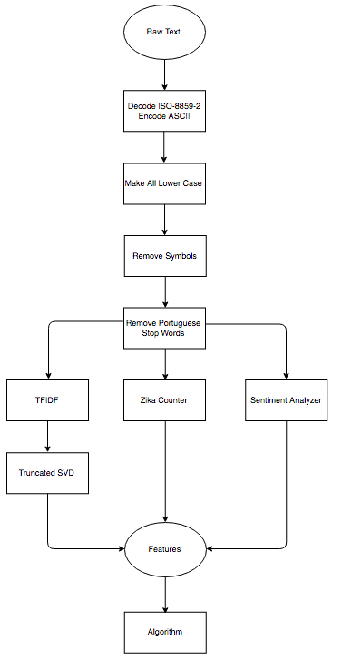

# GYANT: ZIKA CLASSIFICATION USING NLP

## MISSION STATEMENT
Utilizing anonymized raw text data, classify whether a person has Zika or not.

## APPROACH
1. __Exploratory Data Analysis (EDA)__
    * class imbalance ==> (zika ~ 500 samples | not_zika ~ 6500 samples)
    * determined encoding ==> ISO-8859-2 | ASCII | WINDOWS-1252
    * determined language ==> Portuguese (~98%+)

2. __Natural Language Processing (NLP) Pipeline__
    * Transform: decode ISO-8859-2 & encode ASCII
    * Transform: make all charaters lower case
    * Transform: remove symbols and special charaters
    * Transform: remove portuguese stop words
    * Feature Extraction (1 feats): count number of occurrences of the word "zika" (RegEx equivalent ==> [r'z.{2}a']) per document
    * Feature Extraction (4 feats): numerical sentiment polarity scores (positive, neutral, negative, compounded) were given per document 
    * Feature Extraction (n feats): performed latent semantic analysis (LSA), aka, I ran a TFIDF then a SVD(n components) on the processed text
    * 

3. __Training Model(s)__
    * Algorithms: Gradient Boost, Logistic Regression, Random Forest, Gaussian Naive Bayes 
    * Parameters: n principal components
    

## MODEL ANALYSIS
Go to zika\_classification\_model.ipynb for analysis.

## SOLUTIONS
- Obtain more text data ==> GYANT's own medical corpus!
- Build a Word2Vec model for several applications:
    * granular semantic similarity
    * word prediction from text (using continuous bag of words model)
    * context prediction from an input word (skip gram model)
    * engineering new features (for convolution neural networks)
- Build a Latent Dirichlet Allocation (LDA) model for probabilistic topic model. This is can be used to help guide the artificial intelligent doctor (AID) in chat responses. For example, given some text from a person, the AID can determine whether a person is sick or not sick. Or even deteremine if a person is just messing around/trolling the AID via raw text. NOTE: This would need a large corpus to train on in order to perform well.

## THANK YOU
I would like to thank the employers at GYANT for giving an opportunity to apply my NLP skillset in a machine learning application. If you wish to contact me, see below for my contact information:
* e-mail: marwinko19@gmail.com
* phone: (510)368-1756
